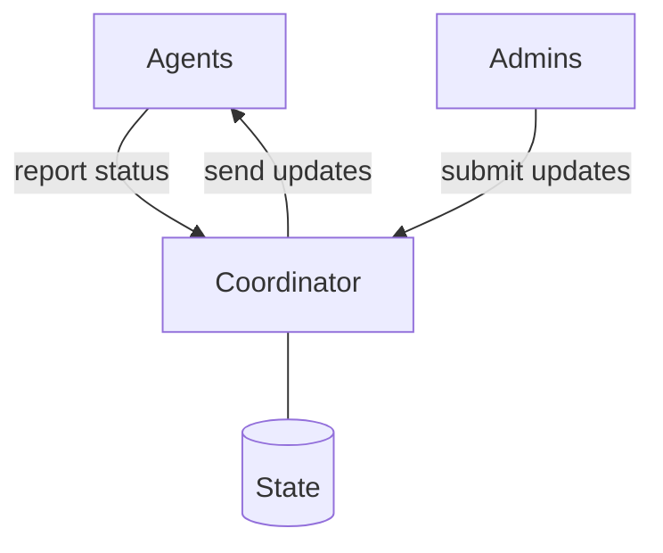

# Nix(OS) fleet management

This project aims to build robust and user-friendly fleet management tooling, tailored for asynchronously managing devices that are capable of and intended to run NixOS. It inherits its motivational roots from [NITS][].

## Features \& Rationale
The logical model encompasses Coordinators, Agents, and Admins. CI/CD systems are merged into the Admin category.




* Asynchronous update chain: Admin -> Coordinator -> Agent
* Overview all managed devices and their update status in as real-time technically possible
* No evaluation during update procedure
* Capability model suitable for organizations
* Audit trail of administrative actions

###  Why Asynchronous/Pull-Based?
For machines that are not always directly reachable via a direct SSH connection, or may never be - e.g. if they are behind NAT or even [Carrier-Grade-NAT](https://en.wikipedia.org/wiki/Carrier-grade_NAT).

### Why Agent-based?
Having intelligent process on-site allows a more sophisticated request towards the update repository, as well as more sophisticated update execution and reporting.

### Why no on-device evaluation?
The assumption is that the devices are not capable of or it's undesired to build the configurations on them. Hence, there is a need for a build-cache and a trusted signature. And something like a CI/CD pipeline, or even just an admin that builds, signs, and pushes the binaries.

In this scenario it's redundant to evaluate again and there's already the need for a trusted signature for the binary cache. It's a low-hanging fruit to make the final closure the update payload, and transmit metadata to the devices that enables them to download and apply the update.

### Why a new tool?
Nix-Fleet continues on the closely proximate [NITS][] experiment and puts a different technological spin on the principles by swapping Go and [NATS](https://nats.io/) for Rust and Iroh for a few reasons. To start with the most subjective, it's the general purpose programming language that the [initial author](https://github.com/steveej) has been enjoying most in recent years for application development. More objectively, it promises for easier integration with the Rust-based Iroh, [Snix](https://snix.dev/), and [NixOps4](https://github.com/nixops4/nixops4). All of which are promising integrations at various points down the line. Iroh has been selected for its native support for endpoint discovery in any network topology without the reliance on external overlay networking, and for its ease of building custom protocols on top of it.

Looking at the wider Nix ecosystem, there are open-source tools for pull-based updates that can provide valuable inspiration. The following list gives an analysis with counter indications that prevent each respective project to be a viable base for the architecture this project aims for. Please raise an issue or pull-request if you notice incorrect or missing important information.

Project | Evaluation | Admin | Server | Agent
--- | --- | --- | --- | ---
[Bento](https://github.com/rapenne-s/bento) | on-device | Shell script | SFTP | Same script as Admin on a systemd timer
[Comin](https://github.com/nlewo/comin) | on-device | git commit/push | Git repository | Golang Agent Daemon periodically polls Git repositories
[npcnix](https://github.com/rustshop/npcnix) | on-device | Rust CLI "packs" Nix Flake source and uploads it to S3 | (AWS) S3| Rust Agent Daemon polls Nix Flake from S3
[NixOS' native `system.autoUpgrade`](https://search.nixos.org/options?channel=unstable&query=system.autoUpgrade) | on-device | All supported [Flake URL types](https://nix.dev/manual/nix/latest/command-ref/new-cli/nix3-flake#types) | depends on flake storage | Shell script on a timer

## Contributing

This project heavily relies on [Nix][nix] to provide a uniform developer workflow. It can be installed from [here][nix-install].


### Development Environment

There's a Nix devShell definition with all Rust dependencies available at `.#devShells.${system}.rust`:

```
nix develop .#rust
```

From here tools like `cargo` are provided and can be used with your favorite IDE.
For an integrated experience there's a [direnv](https://direnv.net/) [configuration](.envrc) provided that automatically loads the Rust development shell.

### CI Tests

This project is set up to build in [Numtide's buildbot-nix instance](https://buildbot.numtide.com/#/projects/37).
All tests that are run on CI can be run locally with Nix:

```
nix flake check
```

### Nix Binary Cache
The CI publishes its build outputs to [a public HTTP binary cache instance][cachix-numtide].

Setting it up locally can speed deployment as well as some actions in local development by downloading pre-built dependencies.

The substitutor URL is `https://numtide.cachix.org` and the public key is `numtide.cachix.org-1:2ps1kLBUWjxIneOy1Ik6cQjb41X0iXVXeHigGmycPPE=`.

The cache has also been specified in the [flake.nix](flake.nix)' `nixConfig` attribute for the sake of communication. The practical effects of this apply only if you run `nix` as a [trusted user](https://nix.dev/manual/nix/2.32/command-ref/conf-file.html#conf-trusted-users), which has considerable security risks and is not recommended. Please carefully read the warning in the linked documentation for more context.

You can use the Cachix CLI to configure the binary cache as described [at the cache site][cachix-numtide] itself.

If you're on NixOS, you use the following in your configuration accordingly:

```nix
# /etc/nixos/configuration.nix
{
  ...

  nix = {
    settings = {
      substituters = [
        "https://numtide.cachix.org"
      ];
      trusted-public-keys = [
        "numtide.cachix.org-1:2ps1kLBUWjxIneOy1Ik6cQjb41X0iXVXeHigGmycPPE="
      ];
    };
  };

  ...
}
```

Please see [the NixOS wiki entry on how to use a binary Cache](https://nixos.wiki/wiki/Binary_Cache#Using_a_binary_cache) for guides for more context.


### Repository Layout

The code is grouped by language or framework name.

#### Nix

This repository uses the [blueprint](https://github.com/numtide/blueprint) structure.

```
/flake.nix
/flake.lock
/nix/ # blueprint set up underneath here.
```

#### Rust

```
/Cargo.toml
/Cargo.lock
/rust/ # all rust code lives here.
/rust/common/Cargo.toml
/rust/common/src/lib.rs
```

---

---

## Funding

### [NLnet Grant][nlnet-grant-1]

This project [is currently funded][nlnet-grant-1] through [NGI Fediversity Fund](https://nlnet.nl/fediversity), a fund established by [NLnet](https://nlnet.nl) with financial support from the European Commission's [Next Generation Internet](https://ngi.eu) program. Learn more at the [NLnet project page](https://nlnet.nl/project/Agent-based-deployment).

[](https://nlnet.nl)


[nlnet-grant-1]: https://nlnet.nl/project/Agent-based-deployment


## License

`SPDX-License-Identifier: MIT OR Apache-2.0`


---

[NITS]: https://github.com/numtide/nits
[cachix-numtide]: https://app.cachix.org/cache/numtide
[nix]: https://nix.dev/manual/nix/2.32/
[nix-install]: https://nixos.org/download/#download-nix
