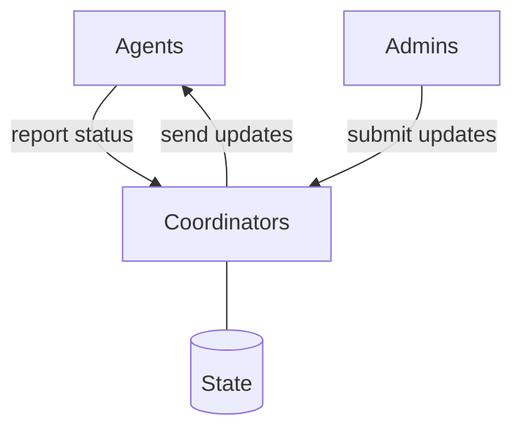

# Nix(OS) fleet management

This project aims to build robust and user-friendly fleet management tooling, tailored for asynchronously managing devices that are capable of and intended to run NixOS. It inherits its motivational roots from [NITS](https://github.com/numtide/nits).

## Features \& Rationale
The logical model encompasses Coordinators, Agents, and Admins. CI/CD systems are merged in to Admin category.




* Asynchronous update chain: Admin -> Coordinator -> Agent
* Overview all managed devices and their update status in as real-time technically possible
* No evaluation during update procedure
* Capability model suitable for organizations
* Audit trail of administrative actions

###  Why Asynchronous/Pull-Based?
For machines that are not always directly reachable via a direct SSH connection, or may never be - e.g. if they are behind NAT or even [Carrier-Grade-NAT](https://en.wikipedia.org/wiki/Carrier-grade_NAT).

### Why Agent-based?
Having intelligent process on-site allows a more sophisticated request towards the update repository, as well as more sophisticated update execution and reporting.

### Why no on-device evaluation?
The assumption is that the devices are not capable of or it's undesired to build the configurations on them. Hence, there is a need for a build-cache and a trusted signature. And something like a CI/CD pipeline, or even just an admin that builds, signs, and pushes the binaries.

In this scenario it's redundant to evaluate again and there's already the need for a trusted signature for the binary cache. It's a low-hanging fruit to make the final closure the update payload, and transmit metadata to the devices that enables them to download and apply the update.

### Why a new tool?
While the following tools provide pull-based updates, they rely on evaluation to take place on the updating device, and aren't architected to support

* [Bento](https://github.com/rapenne-s/bento): Written in Shell and intentionally kept simple. Not easily extensible/modular.
* NixOS' native `system.autoUpgrade`: Just a shell script
* [Comin](https://github.com/nlewo/comin):
* [npcnix](https://github.com/rustshop/npcnix)

## Contributing

### Repository Layout

The code is grouped by language or framework name.

#### Nix

This repository uses the [blueprint](https://github.com/numtide/blueprint) structure.

```
/flake.nix
/flake.lock
/nix/ # blueprint set up underneath here.
```

#### Rust

```
/Cargo.toml
/Cargo.lock
/rust/ # all rust code lives here.
/rust/common/Cargo.toml
/rust/common/src/lib.rs
```

---

---

## Funding

### [NLnet Grant][nlnet-grant-1]

This project [is currently funded][nlnet-grant-1] through [NGI Fediversity Fund](https://nlnet.nl/fediversity), a fund established by [NLnet](https://nlnet.nl) with financial support from the European Commission's [Next Generation Internet](https://ngi.eu) program. Learn more at the [NLnet project page](https://nlnet.nl/project/Agent-based-deployment).

[](https://nlnet.nl)


[nlnet-grant-1]: https://nlnet.nl/project/Agent-based-deployment
