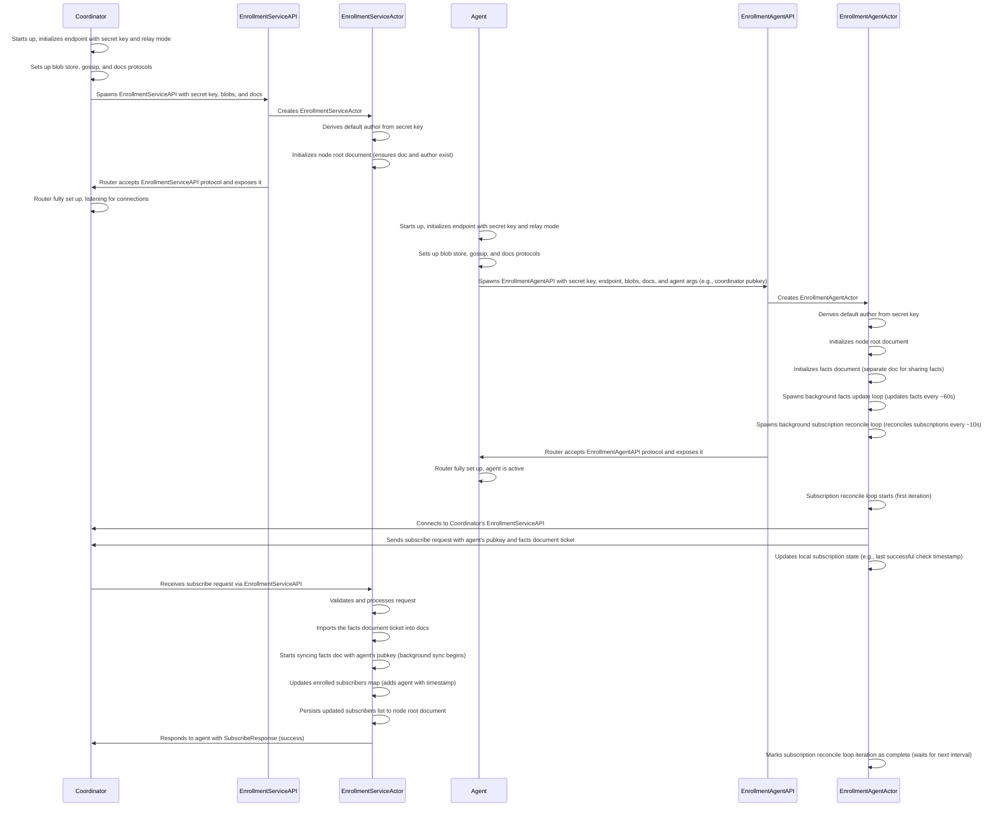

# ROADMAP

This document is for goal setting and tracking over time.
This content is initially taken from the Memorandum of Understanding with NLnet.
The semantics of Epics and Milestones are also inherited from the MoU.

## Phase 1: NixOS Agent-Based Deployment Stack

This phase aims to build robust and user-friendly device management tooling, specifically tailored for asynchronously managing a fleet of devices that are capable of and intended to run NixOS. These requirements were identified as unlocking NixOS adoption in small and medium business and educational organizations.

Upon successful completion of this first phase, the tooling will provide a centralized management system offering access control, fleet oversight, streamlined machine enrollment, and clear feedback on deployment status.

### Epic 1: Architecture Decisions - Coordinator API, Data structures, Forward & Backward Compatibility considerations; Proof-of-Technology

In this epic I want to do the due diligence to evaluate the detailed technical requirements and make informed architectural decisions. I will draw from experience in the Holo-Host and NITS projects and incorporate real-world pain points from Numtide customers. I'm going to develop Proof-of-Technology level code to validate the decisions.

Within this Epic the items below shall be answered architecturally and proven by code.

Outcome: Design of the overall architecture and component internals, issue definitions, working components based on PoT code

#### ***[100 %] Milestone A***: Network connectivity and protocols for synchronous/asynchronous messaging and routed/NAT'ed connections

##### Acceptance Criteria
- [x] AC1: The Coordinator can provide a directly addressable network identity and interface so that Admins and Agents can be configured to connect with a specific Coordinator and effectively form a complete network.
- [x] AC2: Connectivity support for standalone WAN and non-WAN deployments.
- [x] AC3: Components can pass custom protocol messages over the network.
- [x] AC4: There's an extensible mechanism by which a component can submit messages to the Coordinator that caches messages to guarantee eventual delivery, disregarding online-status of any component at the time of original message creation.
- [x] AC5: The message delivery cache persists across component restarts.

##### Solving AC1: [Iroh][] for node connectivity
At its core Iroh is a P2P framework that provides resilient connectivity between nodes.
Using iroh as the connectivity framework provides flexibility for any network topology among the component instances.

The [echo_completes_admin_to_coordinator][] uses the custom `Echo` protocol that ensures the sent data is in fact transmitted and echoed correctly.

This test is quite comprehensive it sets up a Coordinator and Admin to run the Echo in between. More on this follows in subsequent ACs.

##### Solving AC2: Iroh's native discovery and relay mechanism
Iroh natively uses asymmetric ed25519 key pairs to address nodes. As a nice to have side-note: this allows reusing existing SSH keys where desired.

The public key is used as the of a node and is resolved to a network address via a configurable and customizable discovery mechanism. If no direct or hole-punched connection is possible it falls back to a relayed connection in case a relay server is configured and available.

Iroh provides open-source reference implementations for discovery and relay servers. These can be integrated in-process with any component – the Coordinator is the best fit for the requirements – or run in dedicated process.

The [echo_completes_admin_to_coordinator][] exercises an in-process relay and discovery stack between a Coordinator and an Admin. The test relies on the discoverability of the Coordinator's PublicKey, as the `AdminArgs` use the `node_id` to address the other side with no further network information.

##### Solving AC3: Evaluating Iroh's SDK primitives and `irpc`

I'm going to evaluate the low-level native Iroh SDK and `irpc` to send custom data between the Admins, Coordinator, and Agents.

There is also [irpc][]: a higher level SDK add-on which provides an abstraction for building RPC APIs with Iroh.

##### Native Iroh SDK
The implementation of an `Echo` protocol was a mild surprise in the amount of low-level code it requires. Specifically for dealing with boundaries of data across the stream, i.e. message framing, that Iroh does not provide natively.

Besides that, the SDK is equipped for custom protocols and their routing with the help of [Application-Layer Protocol Negotiation (ALPN)][alpn] are plenty sufficient.

The [echo_completes_admin_to_coordinator][] instruments [a custom `Echo` protocol][impl Echo] that's built with the native SDK with bi-directional streaming.

##### [irpc][]
`irpc` comes with a convention of structuring a framed message protocol on top of Iroh.

I wrote [a two variant EchoRpc protocol implemented with `irpc`](https://github.com/numtide/nix-fleet/blob/5cefac0015d130634714b1ee9d09971f7faa5678/rust/lib/src/protocols/echo.rs#L82) and the result ended up with a subjectively clearer structure than the implementation with the lower level SDK.

To understand the overhead I wrote [a majorly unoptimized benchmark](https://github.com/numtide/nix-fleet/blob/5cefac0015d130634714b1ee9d09971f7faa5678/rust/lib/benches/echo_completes.rs#L10).
Unoptimized refers to the initialization costs not being properly factored out before the benchmarks iteration loop.
The result is an approximate 20% overhead in the overall benchmark performance for the `irpc` implementation.

At the current phase I'm concluding this to be acceptable and will opt for `irpc` to benefit from the higher-level building blocks. I'm optimistic that sufficient optimization is possible *if* the protocol transfer speeds turn out to be a bottleneck.

##### Solving AC4: Combine irpc and iroh-docs for sync and async messaging
`irpc` does not provide caching and the remote endpoint needs to be online for a successful message transmission.
Retries would need to be manually implemented between Admins and the Coordinator, as well as in between the Coordinator and the Agents.
This is in-line with the central role of the Coordinator in this phase.

The goal here is to identify the highest level SDK and libraries for eventual i.e. asynchronous message delivery.

There's a [collection of existing protocols](https://www.iroh.computer/proto) which can be built atop of.

Here I'm highlighting the following three that are maintained by the core team and seem related to the problem at hand:
* [iroh-blobs](https://www.iroh.computer/proto/iroh-blobs): Provides blob and blob sequence transfer support for iroh. It implements a simple request-response protocol based on BLAKE3 verified streaming.
* [iroh-gossip](https://www.iroh.computer/proto/iroh-gossip): Gossip protocol based on epidemic broadcast trees to disseminate messages among a swarm of nodes interested in a topic.
* [iroh-docs](https://www.iroh.computer/proto/iroh-docs): Composes iroh-blobs and iroh-gossip to enable multi-dimensional key-value documents with an eventual consistency synchronization protocol. It supports in-memory and persistent storage for documents.

##### Evaluating [iroh-docs]
Given its eventual consistency properties, iroh-docs is a viable candidate to provide runtime-caching for retries out-of-the box.

Here I evaluate a solution that combines synchronous calls via a custom irpc protocol and asynchronous data exchange using iroh-docs.
To avoid avoid the complexity that multiple distributed writers would bring I focus on single-writer documents until at a later stage in the project.

The write and read and write capabilities in iroh-docs consist of asymmetric ed25519 key pairs. As well as the author identities which are used to create and optionally sign document entries.
For operation simplicity I've chosen [to derive these key-pairs](https://github.com/numtide/nix-fleet/blob/1b372629b41ba901e2a0ddfe6619d6f41827bd97/rust/lib/src/protocols/enrollment/mod.rs#L29-L48) from the node's main identity key-pair.

As the evaluation scenario for this pattern I use the a simple version of synchronous Agent enrollment with the Coordinator via irpc, and the continuous delivery of system facts via iroh-docs from the Agent to the Coordinator.
The [admin_can_get_subscriber_facts_via_coordinator test](https://github.com/numtide/nix-fleet/blob/1b372629b41ba901e2a0ddfe6619d6f41827bd97/rust/lib/src/protocols/enrollment/mod.rs#L181) asserts the functionality of this pattern. The following sequence diagram visualizes the tested workflow:

In conclusion this pattern is promising and I'm going to try it out for subsequent features like synchronous update submission and asynchronous distribution.

#### Solving AC5: persistence through iroh-docs and iroh-blobs
iroh-docs supports persisting its data via the [underlying iroh-blobs filesystem store](https://docs.rs/iroh-blobs/0.97.0/iroh_blobs/store/fs/struct.FsStore.html).

I've been able to confirm that the persistence works as expected. [the test called "admin_can_get_subscriber_facts_via_coordinator_after_coordinator_restart"](https://github.com/numtide/nix-fleet/blob/c3994f5907b2b308780697e541f22794ba1fd525/rust/lib/src/protocols/enrollment/mod.rs#L223-L232) confirms that the Coordinator remembers previously enrolled Agents after a restart of the Coordinator.

I conclude that the evidence is in support of continuing with this set up and use it to implement subsequent features.

#### ***[0 %] Milestone B***: Authentication and Authorization Model, credential bootstrap flow for initial Admin, Coordinator, and Agent nodes

#### ***[0 %] Milestone C***: Trust and validation model: starting with signed configuration changes to validation at activation-time on Agent nodes.

#### ***[0 %] Milestone D***: Life-cycle for Coordinator nodes: enrollment, update, decommissioning, failure

#### ***[0 %] Milestone E***: Life-cycle for Agent nodes: enrollment, update, decommissioning, failure

#### ***[0 %] Milestone F***: Life-cycle for Admin credentials: enrollment, update, decommissioning, failure

#### ***[0 %] Milestone G***: Artifact Evaluation, Build, Persistence, Delivery: from `nix build` to the equivalent of `nix copy`

#### ***[0 %] Milestone H***: NixOS Activation: the equivalent of `switch-to-configuration`

#### ***[0 %] Milestone I***: Traffic tunneling to NAT'ed nodes for SSH etc.

#### ***[0 %] Milestone J***: Binary set up: unified CLI or separate binaries, or combination?

### Epic 2: Repository structure, Development Environment, Package Skeletons, Local and CI Testing

The project will require NixOS VM tests. At this point I want to connect the CI to a Nix-native CI (e.g. buildbot-nix, Hydra), preferably an existing instance.

Outcome: Repository on a publicly reachable Forge with Packages, Nix development shell definition, Nix-native CI, Binary Cache

#### ***[60 %] Milestone A***: Complete Nix development shell

##### Acceptance Criteria

- [x] AC1: The repository provides a Nix Flake that exposes a package to build the Rust workspace binaries and run Rust tests.
- [x] AC2: The Nix Flake exposes a devShell that provides dependencies to work on all components and run tests.
- [ ] AC3: The flake exposes a devShell all the release tooling.

##### Solving AC1: use blueprint for Nix Flake setup and crane for Nix packaging of the Rust workspace
Here we can heavily rely on existing frameworks.

Using blueprint for the repository layout because it imposes a simple and sufficient structure for Nix related files. Using the prefix and `nix` subdirectory to keep the top-level clean.
See [flake.nix](./flake.nix) and [nix/](./nix/)

Using [crane](https://crane.dev/) for the [rust-workspace package](nix/packages/rust-workspace.nix) as it's a proven library that wraps around `nixpkgs` library functions and `cargo` itself.

##### Solving AC2: use crane's `devShell` and inherits its dependencies from the Rust workspace package

The [rust devShell](./nix/devshells/rust.nix) uses the Rust specific [craneLib.devShell](https://crane.dev/API.html#cranelibdevshell). 
It inherits its build- and runtime dependencies from the previuosly described `rust-workspace` package to avoid duplication and keep it easier to maintain.

##### Solving AC3: TODO when the first release is published

#### ***[30 %] Milestone B***: Final binary structure for Agent, Coordinator, Admin from PoT code

- [x] AC1: All components can be started interactively for development purposes.
- [ ] AC2: Final binary structure incorporating the insights from the NixOS VM tests.
- [ ] AC3: Well documented hierarchical configuration to that incorporates CLI arguments, configuration files and environment variables

##### Solving AC1: single-binary with subcommands and Justfile for convenience
The main binary `flt` has [an `Applet` enumeration](https://github.com/numtide/nix-fleet/blob/0a768d903b2399d24df9334d0950cad540b2e844/rust/app/src/main.rs#L30-L35) for each component.
There's a subcommand structure for each of them that allows running each component separately.

The [Justfile](./Justfile) has commands to run all components that wrap `cargo run` appropriately and give some sane defaults for development.
These recipes can be discovered using `just --list`.

#### ***[100 %] Milestone C***: Workflows and developer documentation for local and CI testing for Rust and Nix.

#### Acceptance Criteria

- [x] AC1: Choose Rust test harness and linters
- [x] AC2: `nix flake check` runs all Rust workflows
- [x] AC3: document native Rust and Nix wrapped workflow execution

##### Solving AC1: cargo-nextest
Using `cargo-nextest` to run the Rust test suite because it runs each test case in a separate process, supports flaky test heuristics, and provides test grouping/partitioning.

##### Solving AC2: Use blueprint convention with crane's cargo wrappers
According to the blueprint convention, all Nix derivations that are exposes by a packages' `passthru.tests` attribute are automatically exposes as flake checks.
This is implemented in the [rust-workspace package](nix/packages/rust-workspace.nix) with Nix derivations for wrapping the cargo workflows `clippy`, `deny`, `doc`, and `nextest`,

##### Solving AC3: [README#Contributing](./README.md#contributing)
I want to strike a balance the amount of public information that's duplicated in the docs here. Hopefully it's beginner friendly enough to keep encourage contributors or empower them to ask questions on missing information.

#### ***[100 %] Milestone D***: Nix build infrastructure for x86_64-linux and aarch64-linux and signed Nix Binary cache

Because Numtide runs a buildbot instance towards GitHub, this Milestone is the main reason why the repository is hosted there.

- [x] AC1: Pull requests and direct branch pushes run all checks exposed by the Nix Flake
- [x] AC2: CI artifacts can be retrieved via a documented Nix binary cache

##### Solving AC1: Adding the `buildbot-numtide` repository label and verifying

See the [project page on Numtide's Buildbot instance](https://buildbot.numtide.com/#/projects/37).

#### Solving AC2: Adding Binary Cache info to the Nix Flake and README

See [the Nix Binary Cache section in the README](./README.md#nix-binary-cache)

### Epic 3: NixOS VM Integration tests for the PoT code

Building NixOS VM integration tests for the PoT that exists at this stage will allow efficient iteration towards a production-grade code.

#### ***[0 %] Milestone A***: NixOS VM Test: Bootstrap initial coordinator and admin nodes with credentials and make authenticated admin call

#### ***[0 %] Milestone B***: NixOS VM Test: Enroll Agent and make admin call

---

[iroh]: https://www.iroh.computer/
[impl Echo]: https://github.com/numtide/nix-fleet/blob/5cefac0015d130634714b1ee9d09971f7faa5678/rust/lib/src/protocols/echo.rs#L16
[echo_completes_admin_to_coordinator]: https://github.com/numtide/nix-fleet/blob/5cefac0015d130634714b1ee9d09971f7faa5678/rust/lib/src/protocols/echo.rs#L572
[irpc]: https://github.com/n0-computer/irpc
[alpn]: https://en.wikipedia.org/wiki/Application-Layer_Protocol_Negotiation
